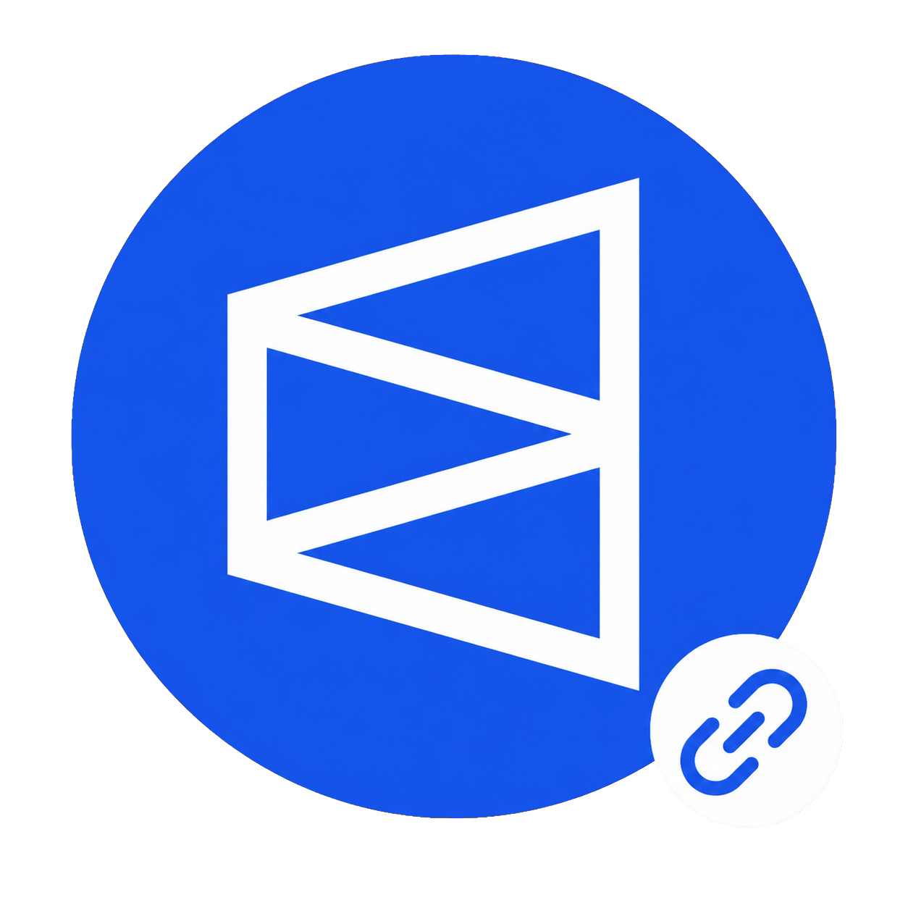
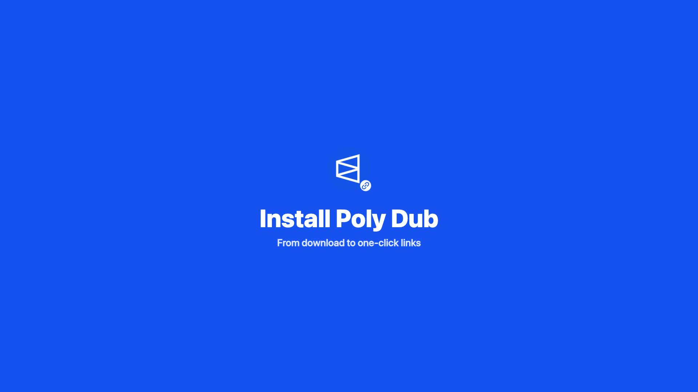

# Poly Dub

  

Poly Dub is a single-purpose Chrome extension for creating and copying a tagged Dub short link from any Polymarket page.

## Demo

  

  <strong><a href="media/poly-dub-install-demo.mp4">Watch the 38-second installation demo</a></strong>

## Install

1. [**Download the latest release ZIP**](https://github.com/parkermclarenpoly/poly-dub/releases/latest/download/poly-dub.zip) and extract it.
2. Open `chrome://extensions` in Chrome.
3. Enable **Developer mode**.
4. Select **Load unpacked** and choose the extracted `poly-dub` folder.
5. Pin **Poly Dub** to the Chrome toolbar.

## Configure

The settings page opens after installation. Add one or more exact Dub tags, choose the default tag, and select **Save settings**. No API key or access token setup is required.

By default, clicking Poly Dub immediately creates a link with the default tag. Enable **Ask me which tag each time** to show the saved-tag picker on every click. In default mode, alternate saved tags remain available from the extension icon's right-click menu.

Tags are stored only in the user's local Chrome extension storage. The Dub API key remains on the Poly Dub server and is never included in the extension or this repository.

To change settings later, right-click the extension icon and select **Options**.

## Use

Open any page on `polymarket.com` and click the Poly Dub toolbar icon. The extension creates the tagged Dub link, copies it to the clipboard, and displays a confirmation on the page.

## Permissions

- `activeTab` and `scripting`: read the current Polymarket page title and copy the resulting short link.
- `storage`: save the user's tags locally.
- `poly-dub-api.vercel.app`: securely request creation of the Dub short link.
- `polymarket.com`: run only on Polymarket pages.

## Server security

The private release package contains a shared credential that can call only the Poly Dub proxy; it cannot access Dub directly. The proxy accepts authenticated `POST` requests only, restricts destination URLs to HTTPS pages on `polymarket.com`, strips the `via` parameter, rate-limits the team credential, and stores only its SHA-256 hash. The real `DUB_API_KEY` remains a sensitive production environment variable and must never be committed to the repository or bundled with the extension.
